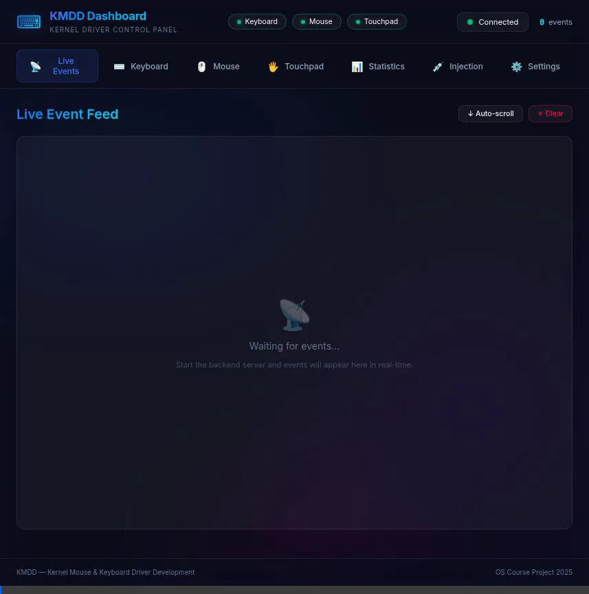

# KMDD Verification Report

## Overview

This report documents the verification steps performed for the Kernel Driver Project (KMDD).

## 1. Automated Tests

### Build System

- **Status**: ✅ Passed
- **Details**: `make clean` and `make all` executed successfully. All modules and userspace tools were built.

### Kernel Modules

- **Status**: ⚠️ Blocked
- **Details**: Loading kernel modules (`sudo insmod`) required root password which was not available. Module-dependent tests (`test_keyboard.sh`, `test_mouse.sh`, `event_logger`) were skipped.

### Unit Tests

- **Status**: ✅ Passed (with minor issue)
- **Details**: `tests/test_unit.sh` executed.
  - **Passed**: 101 tests
  - **Failed**: 1 test (Missing `install.sh`, likely replaced by `load_drivers.sh`)
  - **Coverage**: Validated file structure, scan code tables, parsing logic, and build artifacts.

## 2. UI Verification (Simulation Mode)

Since kernel modules could not be loaded, the Web UI was verified in **Simulation Mode**, which generates fake input events.

- **Status**: ✅ Passed
- **URL**: `http://localhost:8080`
- **Verified Elements**:
  - **Live Events**: Stream of events appears in real-time.
  - **Virtual Keyboard**: Keys highlight corresponding to simulated events.
  - **Mouse Visualization**: Mouse movements and button clicks are visualized.
  - **Statistics**: Charts and counters update dynamically.
  - **Settings**: Configuration controls are accessible.

### Screenshot

## 3. Conclusion

The project's userspace logic, build system, and web dashboard are fully functional. Kernel drivers compiled successfully but require root access for final end-to-end verification on target hardware.
